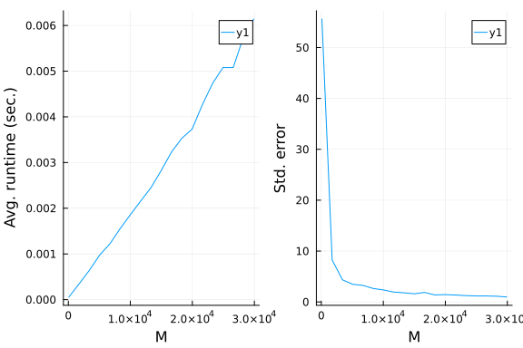

# Testing accuracy and speed of Monte Carlo estimation of marginal likelihood

```julia
using Pkg
Pkg.activate(joinpath(homedir(), ".julia/dev/DiffEqInformationTheory/test"))
using Revise
using Distributed
using DiffEqInformationTheory
using MonteCarloMeasurements, Distributions
using BenchmarkTools
using Plots
```


```julia
@everywhere begin
    using Pkg
    Pkg.activate(joinpath(homedir(), ".julia/dev/DiffEqInformationTheory/test"))
    using DiffEqInformationTheory, Distributions, MonteCarloMeasurements
end
```

```
From worker 6:	  Activating project at `~/.julia/dev/DiffEqInformatio
nTheory/test`
      From worker 5:	  Activating project at `~/.julia/dev/DiffEqInformatio
nTheory/test`
      From worker 7:	  Activating project at `~/.julia/dev/DiffEqInformatio
nTheory/test`
      From worker 2:	  Activating project at `~/.julia/dev/DiffEqInformatio
nTheory/test`
      From worker 3:	  Activating project at `~/.julia/dev/DiffEqInformatio
nTheory/test`
      From worker 4:	  Activating project at `~/.julia/dev/DiffEqInformatio
nTheory/test`
      From worker 8:	  Activating project at `~/.julia/dev/DiffEqInformatio
nTheory/test`
```


## Setup

With 60 observations, $P(y\mid \theta)$ will tend to be very narrow in $\theta$.

```julia
θtrue = (S₀=0.6f0, β=1.25f0, α=0.2f0)
@everywhere θprior = (S₀=Uniform(0.1f0, 0.9f0), β=Uniform(0.3f0, 3f0), α=Uniform(0.05f0, 0.3f0))

@everywhere obs_mod = PoissonTests(1000)
inf_true = solve(SIRModel{Float32}(;θtrue...); saveat=0.5, save_idxs=2).u # 60 observations
@everywhere ysamp = rand(observe_dist(obs_mod; observe_params(obs_mod, $inf_true)...))
```


```julia
@everywhere function marg_lik(y, om, θprior, M)
    sir = SIRModel{Float32}(
        S₀=Particles(M, θprior.S₀), 
        β=Particles(M, θprior.β), 
        α=Particles(M, θprior.α)
    )

    inf = solve(sir; saveat=0.5, save_idxs=2).u
    lp = logpdf_particles(om, inf, y)
    marginal_likelihood(lp)
end
```


```julia
reps = map(range(100, 30_000, length=20)) do M
    M = floor(Int, M)
    a = @benchmark marg_lik($ysamp, $obs_mod, $θprior, $M)
    v = pmap(_->marg_lik(ysamp, obs_mod, θprior, M), 1:100)
    (M=M, min_time=minimum(a).time, mean_time=mean(a).time, mean_res=mean(v), std_res=std(v))
end

CSV.write("ml-bench-res.csv", DataFrame(reps))
```

```julia
using CSV, DataFrames

reps = CSV.read("ml-bench-res.csv", DataFrame)
plot(
    plot(reps.M, (10^-9*reps.mean_time)/60, yaxis=("Avg. runtime (sec.)")),
    plot(reps.M, reps.std_res, yaxis=("Std. error")),
    xaxis=("M")
)
```


